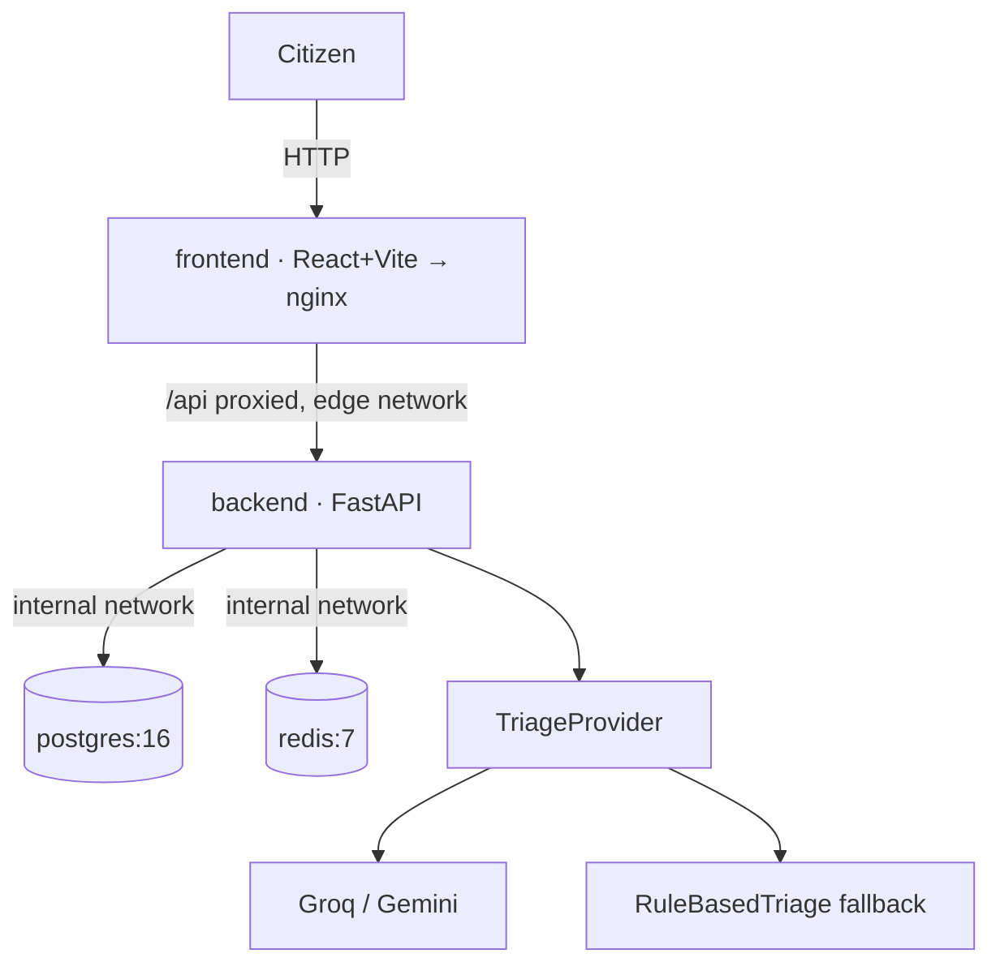

# CivicPulse

Municipal complaint intake, triage and operations platform — CS4032
Software Construction and Design, Assignment 01.

> Backend/data/cache/AI layer badges and details are Person 1's to fill in
> once `backend/` exists. This README currently covers what Person 2 owns:
> frontend, Docker/Compose, Kubernetes and CI/CD.

## Quickstart

```bash
cp .env.example .env        # fill in POSTGRES_PASSWORD at minimum
make dev                    # = docker compose -f compose.yaml up --build
```

Run `make help` for every shortcut (`make lint`, `make test`, `make check`,
`make k8s-dev-up`, `make load-test`, ...). `make check` runs
`scripts/check_submission.py`, a lint against the §5.3 automatic-deduction
rules (unpinned images, published DB/cache ports in prod, non-placeholder
secrets, ungated publish jobs, ...) — run it before every push, not just
before the final submission.

- Frontend: http://localhost:5173
- Backend:  http://localhost:8000 (once Person 1's `backend/` exists)

The frontend build/lint/test commands below have been run for real against
this repository (not just written):

```bash
cd frontend
npm ci
npm run lint        # eslint — 0 problems
npx tsc --noEmit     # typecheck — clean
npx vitest run       # 9 tests, 4 files — all passing
npm run build        # tsc -b && vite build — produces dist/
```

## Architecture



Two Docker networks enforce that only `backend` can reach `postgres`/`redis`
— see `compose.yaml` and `k8s/base/*.yaml`. `docker compose exec frontend
ping postgres` is expected to fail; that failure is the network-segmentation
evidence required for the demo video.

## Running on Kubernetes (k3d / kind)

```bash
# Build local images first
docker build -t civicpulse-frontend:dev ./frontend
docker build -t civicpulse-backend:dev ./backend   # once backend/ exists

k3d cluster create civicpulse-dev --agents 1
k3d image import civicpulse-frontend:dev civicpulse-backend:dev -c civicpulse-dev

kubectl apply -k k8s/overlays/dev
kubectl -n civicpulse get pods -w
```

`k8s/base` and both overlays have been validated with real tooling
(`kustomize build` succeeds for all three; `kubeconform -strict` reports 15
valid Kubernetes resources for base/dev, and 14 for prod, which deliberately
doesn't ship the placeholder Secret — see `k8s/overlays/prod/kustomization.yaml`;
the VerticalPodAutoscaler CRD is correctly skipped as a non-core schema) — see `docs/ENGINEERING-NOTES.md` Q2/Q3.

## Repository layout

See `docs/adr/` for the "why" behind the frontend runtime-config and
deploy-by-SHA decisions, and `docs/RUNBOOK.md` for deploy/rollback/logs
procedures.

## Status

| Area | Owner | Status |
|---|---|---|
| Frontend (Submit/Dashboard/Stats, typed client, error boundary) | Person 2 | Built, tested |
| Docker/Compose (networks, volumes, healthchecks) | Person 2 | Built, YAML-validated |
| Kubernetes manifests (base + dev/prod overlays) | Person 2 | Built, `kustomize`+`kubeconform`-validated |
| CI/CD workflows (ci/cd/release) | Person 2 | Written, `actionlint`- and `shellcheck`-validated |
| Submission linter (`scripts/check_submission.py`) | Person 2 | Written, self-tested (verified it both passes clean and catches planted violations) |
| K8s secrets helper (`scripts/create-k8s-secrets.sh`) | Person 2 | Written, `shellcheck`-validated |
| `Makefile` | Person 2 | Written |
| Backend (routes/services/repositories/providers) | Person 1 | Not started |
| Data layer (Alembic, seed script) | Person 1 | Not started |
| Cache layer (rate limiter, stats cache) | Person 1 | Not started |
| AI layer (TriageProvider implementations) | Person 1 | Not started |

Screenshots, demo video and the remaining `docs/ENGINEERING-NOTES.md`
questions go in before submission — see `docs/RUNBOOK.md` and the ADRs for
what's already written.
